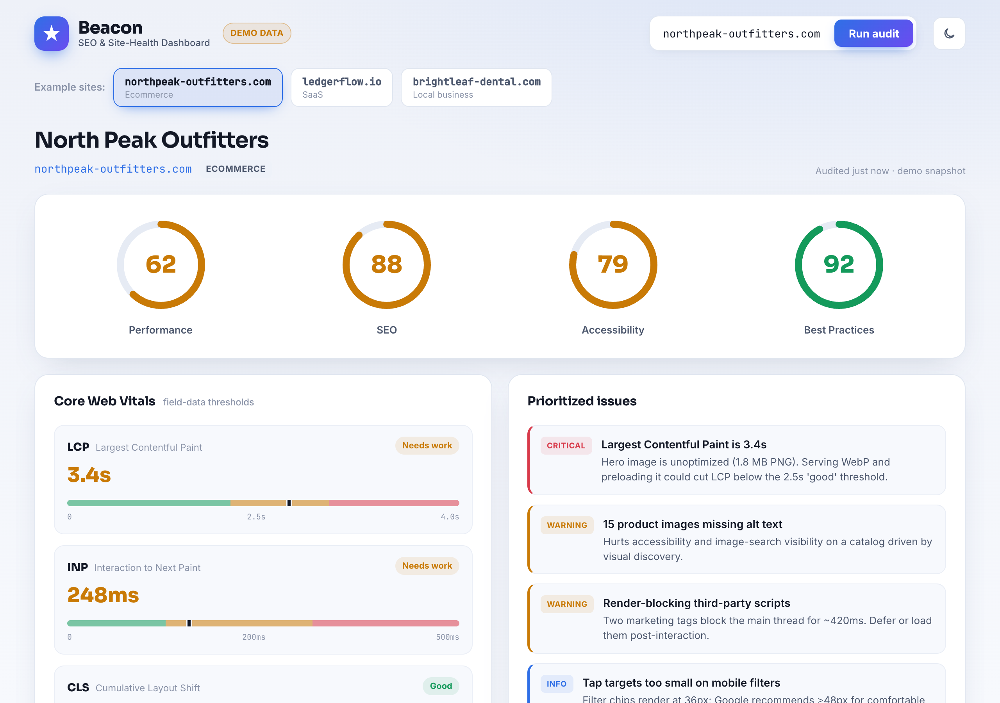

# Beacon — SEO & Site-Health Dashboard

A polished, agency-grade **SEO & Core Web Vitals dashboard** built as a front-end
portfolio piece. It presents a Lighthouse-style site audit — score rings, Core Web
Vitals, an on-page SEO checklist, keyword rankings, prioritized issues, and a
responsive-preview widget — in a clean, premium client-dashboard UI.

**Live demo:** https://beacon-seo.pages.dev
**Source:** https://github.com/tachyurgy/beacon-seo-dashboard



> **Demo data, not a live crawl.** Beacon uses bundled **illustrative sample data**
> for three fictional sites — it does **not** fetch or audit real URLs. This is a
> design/engineering showcase, and every screen is clearly labelled "Demo data" in
> the UI. The numbers are realistic but invented for demonstration.

## Highlights

- **Four animated SVG score gauges** (Performance, SEO, Accessibility, Best
  Practices) — hand-coded circular gauges that ease from 0 → value with a `cubic`
  easing curve and color-code green / orange / red by Lighthouse thresholds. No
  chart library.
- **Core Web Vitals panel** scoring LCP, INP and CLS against Google's real field
  thresholds (LCP ≤2.5s, INP ≤200ms, CLS ≤0.1 = "good"), each with a banded
  threshold bar showing exactly where the value lands.
- **On-page SEO audit checklist** — title tag, meta description, single H1, image
  alt coverage, canonical, robots/sitemap, structured data, Open Graph, HTTPS and
  mobile-friendliness — each row with a pass / warn / fail icon and a one-line
  explanation, plus a summary count.
- **Sortable keyword-rankings table** — click any column header to sort (keyword,
  position, change ▲▼, search volume, URL) with a sticky header and hover states.
- **Prioritized issues** with critical / warning / info severity badges and impact
  descriptions.
- **Responsive-preview widget** — a mobile / tablet / desktop toggle that animates a
  mock site frame between device sizes.
- **Three distinct datasets** — switch between an ecommerce store, a SaaS product,
  and a local business; every number, score, and recommendation changes.
- **Audit-run animation** — "Run audit" plays a short staged scanning sequence
  (progress ring + step labels) before revealing the report.
- **Light / dark theme** toggle that persists to `localStorage` and respects the
  system color scheme on first visit.
- **Fully responsive** — real CSS media queries; verified zero horizontal overflow
  from 390px up.

## Stack

- **React 19** (function components + hooks: `useState`, `useEffect`, `useRef`, `useMemo`)
- **Vite** for build/dev tooling
- **Hand-written CSS** — CSS custom properties for theming, no UI kit
- **Hand-coded SVG** for all gauges, charts, and icons — no chart or icon libraries
- Google Fonts: Sora (display), Inter (body), JetBrains Mono (data)

Dependencies are intentionally minimal — only `react`, `react-dom`, and the Vite
React plugin. Everything visual is built from scratch to demonstrate HTML5/CSS3 and
SVG craft.

## Run locally

```bash
npm install
npm run dev      # start the dev server (http://localhost:5173)
npm run build    # production build → dist/
npm run preview  # preview the production build
```

`vite.config.js` sets `base: './'` so the build works on static hosts such as
Cloudflare Pages.

## Project structure

```
src/
  App.jsx                 # layout, theme, audit-run state machine
  data.js                 # three bundled demo datasets + vitals thresholds
  index.css               # full design system (tokens, components, media queries)
  components/
    ScoreRing.jsx         # animated circular SVG gauge
    CoreWebVitals.jsx     # LCP / INP / CLS cards with threshold bars
    SeoChecklist.jsx      # pass/warn/fail on-page audit list
    KeywordTable.jsx      # sortable rankings table
    IssuesList.jsx        # prioritized issues with severity badges
    ResponsivePreview.jsx # device-size preview widget
    Icons.jsx             # hand-coded SVG icons
```

## Attribution

Built by **Levelbrook Consulting** as a front-end portfolio piece.
Demo data is illustrative and for demonstration only.
